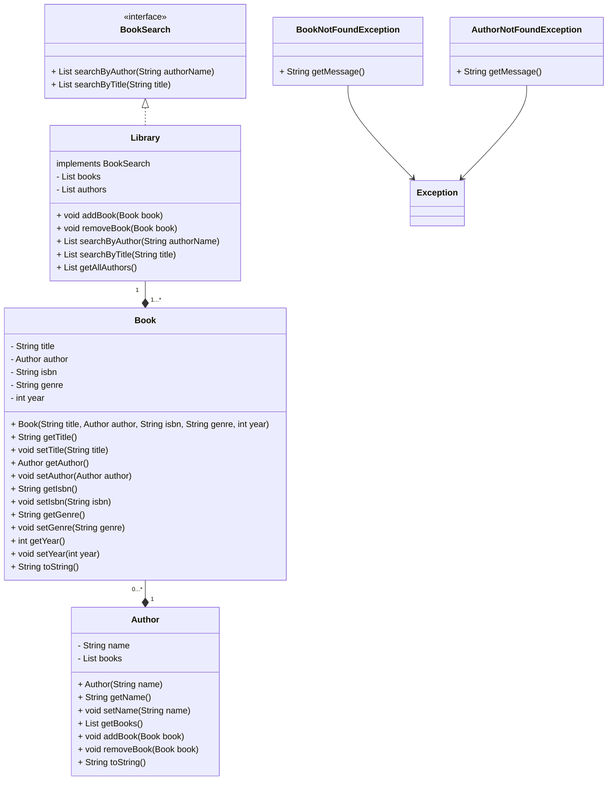

```mermaid
classDiagram
class Book {
  - String title
  - Author author
  - String isbn
  - String genre
  - int year
  + Book(String title, Author author, String isbn, String genre, int year)
  + String getTitle()
  + void setTitle(String title)
  + Author getAuthor()
  + void setAuthor(Author author)
  + String getIsbn()
  + void setIsbn(String isbn)
  + String getGenre()
  + void setGenre(String genre)
  + int getYear()
  + void setYear(int year)
  + String toString()
}

class Author {
  - String name
  - List<Book> books
  + Author(String name)
  + String getName()
  + void setName(String name)
  + List<Book> getBooks()
  + void addBook(Book book)
  + void removeBook(Book book)
  + String toString()
}

class BookSearch {
<<interface>>
  + List<Book> searchByAuthor(String authorName)
  + List<Book> searchByTitle(String title)
}

class Library {
implements BookSearch 
  - List<Book> books
  - List<Author> authors
  + void addBook(Book book)
  + void removeBook(Book book)
  + List<Book> searchByAuthor(String authorName)
  + List<Book> searchByTitle(String title)
  + List<Author> getAllAuthors()
}

class BookNotFoundException {
  + String getMessage()
}

class AuthorNotFoundException {
  + String getMessage()
}

Book "0...*" --* "1"  Author
BookSearch <|.. Library
Library "1" --* "1...*" Book 
BookNotFoundException --> Exception
AuthorNotFoundException --> Exception
```