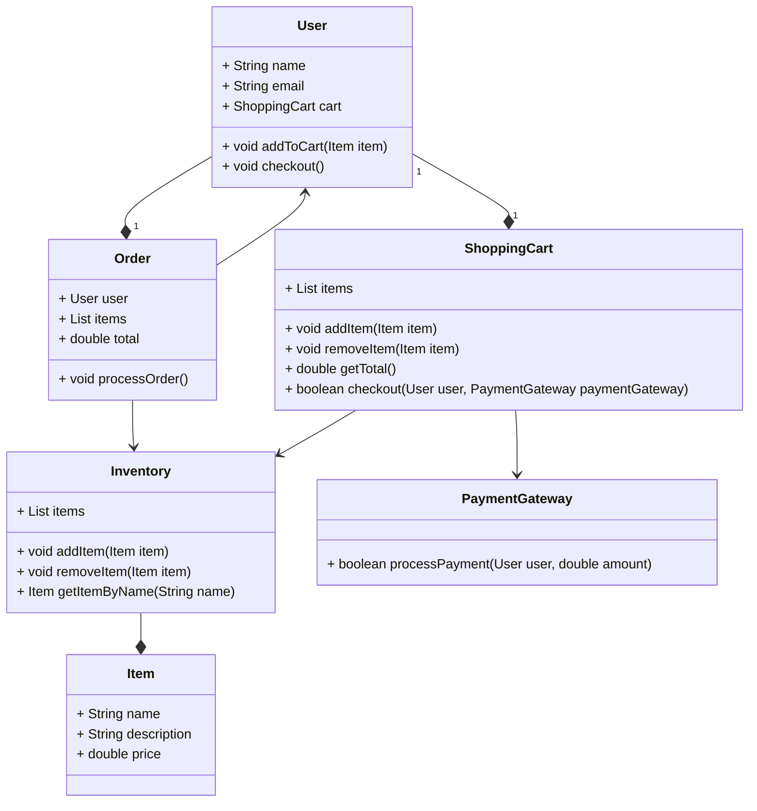

```mermaid
classDiagram
class User {
+ String name
+ String email
+ ShoppingCart cart
+ void addToCart(Item item)
+ void checkout()
}

    class Item {
        + String name
        + String description
        + double price
    }

    class Order {
        + User user
        + List<Item> items
        + double total
        + void processOrder()
    }

    class Inventory {
        + List<Item> items
        + void addItem(Item item)
        + void removeItem(Item item)
        + Item getItemByName(String name)
    }

    class PaymentGateway {
        + boolean processPayment(User user, double amount)
    }

    class ShoppingCart {
        + List<Item> items
        + void addItem(Item item)
        + void removeItem(Item item)
        + double getTotal()
        + boolean checkout(User user, PaymentGateway paymentGateway)
    }

    User "1" --* "1" ShoppingCart
    User --* "1"Order
    Order --> User
    Order --> Inventory
    Inventory --* Item
    ShoppingCart --> Inventory
    ShoppingCart --> PaymentGateway
```